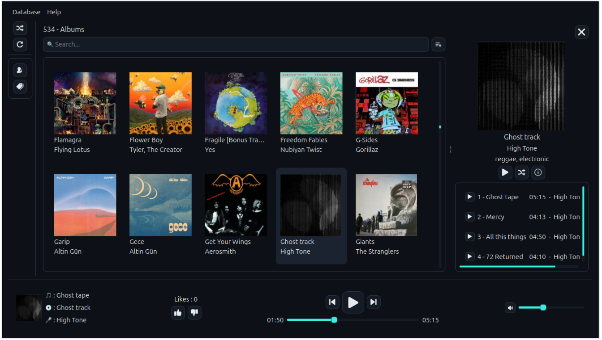
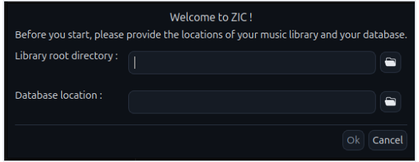
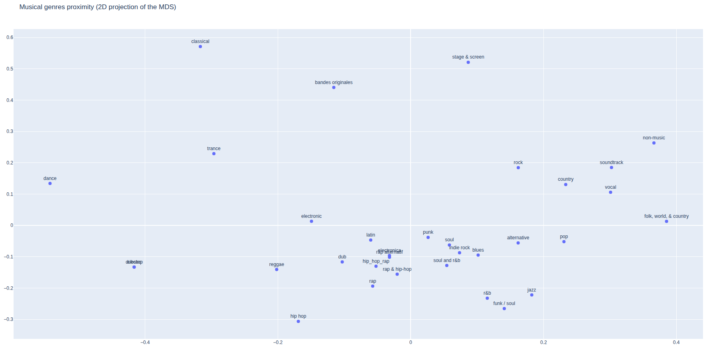

<div align=center>
    
    <h1>ZIC</h1>
    <p>A local-library desktop music player with album/genre browsing and genre-aware smart playlists.</p>



</div>


## Features

- Play local MP3/M4A music files
- Navigate in your albums, artists, genres
- Automatic metadata enrichment with Discogs API
- Genre intelligence : genre proximity is computed from your own library's co-occurrence patterns, not a fixed taxonomy (see [Genre Intelligence](#genre-intelligence))
- "Smart" playlists : album -> artist's discography -> near genres -> random
- Likes and plays history systems

## Prerequisites

- Python 3.11+
- **Audio codecs** : ZIC relies on Qt Multimedia to play MP3/M4A files, which in turn relies on system-level codecs (via FFmpeg on most platforms). If you get no sound with no error, install FFmpeg for your OS:

  | OS | Command |
  | - | - |
  | Linux (Debian/Ubuntu) | `sudo apt install ffmpeg` |
  | Linux (Arch) | `sudo pacman -S ffmpeg` |
  | macOS (Homebrew) | `brew install ffmpeg` (maybe no action needed) |
  | Windows | Usually bundled with Qt Multimedia, no action needed |

## Installation

### With `uv` (Recommended)

[uv](https://docs.astral.sh/uv/getting-started/installation/) is a faster and more convenient package manager than `pip`

```bash
# cd where you want to create the virtual env
uv venv zic-venv

source zic-venv/bin/activate # Linux/macOS
# zic-venv\Scripts\activate  # Windows

uv pip install zic
```

### Quick install

```bash
pip install zic
```

## Getting started

### Import your library

```bash
zic ingest /path/to/your/library
```

### First launch

```bash
zic
```

The first time you launch ZIC, a welcome dialog will ask you to register where your MP3/M4A library and your database are located.



## Genre Intelligence

Most music apps treat genres as a flat, external taxonomy. ZIC does something different: it computes how *your* genres relate to each other based on how they actually co-occur across your own albums.

### How it works

1. **Co-occurrence analysis** — ZIC looks at which genre tags appear together on the same albums in your library.
2. **Positive PMI (Pointwise Mutual Information)** — rather than raw counts (which would let generic tags like "rock" dominate purely through volume), ZIC measures how much more often two genres co-occur than pure chance would predict, with discounting to avoid overweighting rare pairs.
3. **Classical MDS (Multidimensional Scaling)** — the resulting similarity scores are projected into a compact set of coordinates per genre, positioning genres close together when they tend to appear side by side in your collection, and far apart when they don't.

These positions power the **genre-aware smart playlists** (finding "near genres" when an album and its artist's discography are exhausted) and can be visualized directly.

### Computing positions

Run this after importing your library, and again whenever you've ingested enough new albums that genre relationships might have shifted:

```bash
zic genres compute ~/Music/.db
```

### Visualizing genre space

See how your own genres cluster together, in an interactive 2D plot opened in your browser:

```bash
zic genres vis ~/Music/.db
```



>[!NOTE]
>These visualizations are in 2D, so they are partial representations of the real space which is in 8 dimensions

## Configuration

### App config

A toml file containing the library directory and database locations

| OS | Location |
| - | - |
| Linux | ~/.config/Zic/app_config.toml |
| Windows | %LOCALAPPDATA%\Zic\app_config.toml |
| Mac Os | ~/Library/Application Support/Zic/app_config.toml |

### User Config

When closed, ZIC saves your preferences in a json file

| OS | Location |
| - | - |
| Linux | ~/.local/share/Zic/user_config.json |
| Windows | %LOCALAPPDATA%\Zic\user_config.json |
| Mac Os | ~/Library/Application Support/Zic/user_config.json |

### Ingestor environment variables

While running the ingestor, you can specify your Discogs API credentials with the following environment variables : `ZIC_INGESTOR_DISCOGS_KEY` and `ZIC_INGESTOR_DISCOGS_TOKEN`

### Hotkeys

| Key | Action |
| - | - |
| Space | Toggle play/pause |
| m | Mute |
| n | Next song |
| p | Previous song |
| F5 | Reload library |
| s | Shuffle playlist |
| Right arrow | Advance playback (5s) |
| Left arrow | Rewind playback (5s) |
| + | Volume up |
| - | Volume down |
| l | Like current song |
| d | Dislike current song |

## CLI Reference

```bash
❯ zic --help
Usage: zic [OPTIONS] [COMMAND] [ARGS]...

  A local-library desktop music player with album/genre browsing and genre-
  aware smart playlists.

Options:
  -V      Show the current version of ZIC
  --help  Show this message and exit.

Commands:
  genres  Manage genre proximity positions used to build genre-aware...
  ingest  Ingests an audio library (mp3/m4a) into a SQLite database.

  Run the GUI : zic
```

## Contributing

Contributions are welcome !

### Installation

1. Clone this repository
2. cd into `zic`
3. Create a venv

```bash
uv venv
source .venv/bin/activate # Linux/macOS
# .venv\Scripts\activate  # Windows
```

4. Install zic as editable package

```bash
uv pip install -e .
```

### Debug

You can set the `ZIC_DEVEL=1` env var to activate the debug level of logging.

### Run tests

1. Install pytest in your virtual environment

```bash
uv pip install pytest
```

2. Run the test suite

```bash
pytest tests/
```

## License

See [LICENSE](LICENSE).
